# Angular Commerce Chat

**Build an AI Shopping Agent for SAP Commerce / Spartacus Storefronts**

An AI agent solution that understands natural language, searches products, manages shopping carts, and completes orders - all through conversational interactions. Powered by Claude (or OpenAI/Gemini), integrated with SAP Commerce Cloud via the Model Context Protocol (MCP).

<br/>

Watch a quick demo:

[](https://vimeo.com/1140630736)

## What is This?

This agent can:
- 🛍️ Search and recommend products based on natural language queries
- 🛒 Add items to cart, update quantities, and manage orders
- 💳 Process complete checkout flows
- 🎯 Provide personalized recommendations for authenticated users
- 📊 Access real-time product data, pricing, and availability

The agent uses **agentic AI** patterns - it thinks, plans, and executes multi-step tasks by calling SAP Commerce APIs through the MCP protocol.

## Architecture

### High-Level Overview

```
┌──────────────────────────────────────────────────────────────┐
│                     Your Storefront                          │
│  ┌────────────────────────────────────────────────────────┐  │
│  │         Angular Chat UI Component                      │  │
│  │  • Conversational interface                            │  │
│  │  • Product card rendering                              │  │
│  │  • Real-time streaming responses                       │  │
│  └─────────────────────┬──────────────────────────────────┘  │
└────────────────────────┼─────────────────────────────────────┘
                         │ HTTP/WebSocket
                         │
┌────────────────────────▼─────────────────────────────────────┐
│              Bridge Service (Middleware)                     │
│  ┌───────────────────────────────────────────────────────┐  │
│  │   AI Agent Orchestration                              │  │
│  │   • Claude / OpenAI / Gemini                          │  │
│  │   • Multi-turn conversations                          │  │
│  │   • Session & context management                      │  │
│  │   • Tool/function calling                             │  │
│  └─────────────────────┬─────────────────────────────────┘  │
└────────────────────────┼─────────────────────────────────────┘
                         │ MCP Protocol
                         │ (Model Context Protocol)
┌────────────────────────▼─────────────────────────────────────┐
│                    MCP Server                                │
│  ┌───────────────────────────────────────────────────────┐  │
│  │   SAP Commerce Cloud Integration                      │  │
│  │   • Product catalog & search                          │  │
│  │   • Cart operations (CRUD)                            │  │
│  │   • Order management & checkout                       │  │
│  │   • Store inventory & locations                       │  │
│  │   • Customer data & personalization                   │  │
│  └─────────────────────┬─────────────────────────────────┘  │
└────────────────────────┼─────────────────────────────────────┘
                         │ OCC REST API
                         │
┌────────────────────────▼─────────────────────────────────────┐
│               SAP Commerce Cloud (Backend)                   │
│  • Product catalog                                           │
│  • Shopping cart engine                                      │
│  • Order management                                          │
│  • Customer profiles                                         │
└──────────────────────────────────────────────────────────────┘
```

### Agent Interaction Flow

```
User: "Show me cameras under $500"
  │
  ├─> Angular UI sends message
  │
  ├─> Bridge Service receives & passes to AI
  │
  ├─> AI Agent (Claude) reasons:
  │   "I need to search for cameras with price filter"
  │   └─> Calls MCP tool: search-products-advanced
  │       (query="cameras", maxPrice=500)
  │
  ├─> MCP Server executes:
  │   └─> Calls SAP Commerce OCC API
  │       GET /products/search?query=cameras&priceRange=0-500
  │
  ├─> Returns product data to AI
  │
  ├─> AI Agent formats response:
  │   "I found 12 cameras under $500..."
  │   [Product cards with images, prices, specs]
  │
  └─> Bridge streams response to UI
      └─> User sees results in real-time
```

### Visual Flow Diagram

```mermaid
graph TB
    subgraph Frontend["🖥️ Frontend Layer"]
        User["👤 User<br/><i>Natural language query</i>"]
        ChatUI["💬 Angular Chat UI<br/>• Message input/display<br/>• Product cards<br/>• Real-time streaming"]
    end

    subgraph Middleware["⚙️ Middleware Layer"]
        Bridge["🔄 Bridge Service<br/>• Session management<br/>• AI orchestration<br/>• Tool calling"]
        AI["🤖 AI Agent<br/><b>Claude / OpenAI / Gemini</b><br/>• Query understanding<br/>• Task planning<br/>• Response generation"]
    end

    subgraph Integration["🔌 Integration Layer"]
        MCP["📡 MCP Server<br/>• Tool definitions<br/>• API integration<br/>• Data transformation"]
    end

    subgraph Backend["☁️ Backend Layer"]
        SAP["🛒 SAP Commerce Cloud<br/>• Product catalog<br/>• Cart & orders<br/>• Customer data"]
    end

    User -->|"Show me cameras<br/>under $500"| ChatUI
    ChatUI -->|"HTTP/SSE"| Bridge
    Bridge <-->|"Prompt &<br/>tool results"| AI
    AI -->|"Tool call:<br/>search-products"| Bridge
    Bridge -->|"MCP Protocol"| MCP
    MCP -->|"OCC REST API"| SAP
    SAP -.->|"Product data"| MCP
    MCP -.->|"Tool result"| Bridge
    Bridge -.->|"Formatted<br/>response"| AI
    AI -.->|"Natural language +<br/>structured data"| Bridge
    Bridge -.->|"Streaming<br/>response"| ChatUI
    ChatUI -.->|"Product cards +<br/>text response"| User

    classDef frontend fill:#e1f5ff,stroke:#0288d1,stroke-width:2px
    classDef middleware fill:#fff3e0,stroke:#f57c00,stroke-width:2px
    classDef integration fill:#f3e5f5,stroke:#7b1fa2,stroke-width:2px
    classDef backend fill:#e8f5e9,stroke:#388e3c,stroke-width:2px

    class User,ChatUI frontend
    class Bridge,AI middleware
    class MCP integration
    class SAP backend
```



## Quick Start

Get the chat running in your storefront in 4 steps:

### 1. Clone and Install Dependencies

```bash
# Clone the repository
git clone https://github.com/hub-cloud/angular-commerce-chat.git
cd angular-commerce-chat

# Install all packages
cd packages/mcp-server && npm install && cd ../..
cd packages/bridge-service && npm install && cd ../..
cd packages/ui && yarn install && cd ../..
```

### 2. Configure Environment Variables

**MCP Server** (`packages/mcp-server/.env`):
```bash
cp packages/mcp-server/.env.example packages/mcp-server/.env
```

Edit `.env` with your SAP Commerce credentials:
```env
SAP_COMMERCE_BASE_URL=https://your-commerce-instance.com
SAP_COMMERCE_CLIENT_ID=your_client_id
SAP_COMMERCE_CLIENT_SECRET=your_client_secret
PORT=3001
```

**Bridge Service** (`packages/bridge-service/.env`):
```bash
cp packages/bridge-service/.env.example packages/bridge-service/.env
```

Edit `.env` with your AI provider API key (at least one required):
```env
ANTHROPIC_API_KEY=your_claude_api_key
# or GEMINI_API_KEY=your_gemini_api_key
# or OPENAI_API_KEY=your_openai_api_key

MCP_SERVER_URL=http://localhost:3001
PORT=3000
```

### 3. Build the Services

**IMPORTANT:** Both services must be built before starting (first time only).

```bash
# Build MCP Server
cd packages/mcp-server
npm run build   # First time only - compiles TypeScript

# Build Bridge Service
cd ../bridge-service
npm run build   # First time only - compiles TypeScript
```

**Note:** After the initial build, you only need to rebuild if you modify the source code.

### 4. Start the Bridge Service

The bridge service automatically spawns the MCP server as a child process, so you only need to start the bridge service:

```bash
cd packages/bridge-service
npm start
```

Verify the service is running:
- Bridge Service: http://localhost:3000
- The MCP server runs as a subprocess (no separate startup needed)

## Installing in Your Storefront

### Build and Install the Library

**Step 1: Build and Create Package**
```bash
# From the angular-commerce-chat project root
cd angular-commerce-chat/packages/ui

# Install dependencies (first time only)
npm install

# Build the library
npm run build

# Create tarball package
cd dist/sap-commerce-chat
npm pack
```

This creates: `angular-commerce-chat-0.0.1.tgz` in `packages/ui/dist/sap-commerce-chat/`

**Step 2: Install in Your Storefront**

With npm:
```bash
cd /path/to/your/storefront
npm install /path/to/angular-commerce-chat/packages/ui/dist/sap-commerce-chat/angular-commerce-chat-0.0.1.tgz
```

With yarn:
```bash
cd /path/to/your/storefront
yarn add file:/path/to/angular-commerce-chat/packages/ui/dist/sap-commerce-chat/angular-commerce-chat-0.0.1.tgz
```

**Step 3: Verify Installation**

Check that `angular-commerce-chat` appears in your `package.json`:
```bash
cat package.json | grep angular-commerce-chat
```

You should see something like:
```json
"angular-commerce-chat": "file:../angular-commerce-chat/packages/ui/dist/sap-commerce-chat/angular-commerce-chat-0.0.1.tgz"
```

**If the package is NOT in package.json, the integration will fail!**

## Integrate in Your Angular App

### For Module-Based Apps (Spartacus)

Complete integration requires updating 3 files:

#### Step 1: Update `app.module.ts`

```typescript
import {
  ChatWindowComponent,
  ChatService,
  SPARTACUS_AUTH_SERVICE,
  SPARTACUS_USER_ID_SERVICE,
  SPARTACUS_AUTH_STORAGE_SERVICE
} from 'angular-commerce-chat';
import { AuthService, UserIdService, AuthStorageService } from '@spartacus/core';

@NgModule({
  declarations: [
    AppComponent
  ],
  imports: [
    BrowserModule,
    // ... other existing imports
    ChatWindowComponent  // ← Standalone component goes in imports (NOT declarations)
  ],
  providers: [
    // ... other providers
    ChatService,  // ← IMPORTANT: Explicitly provide the service to avoid injection errors
    // Wire up Spartacus auth services for authenticated chat (REQUIRED for personalization)
    { provide: SPARTACUS_AUTH_SERVICE, useExisting: AuthService },
    { provide: SPARTACUS_USER_ID_SERVICE, useExisting: UserIdService },
    { provide: SPARTACUS_AUTH_STORAGE_SERVICE, useExisting: AuthStorageService }
  ],
  bootstrap: [AppComponent]
})
export class AppModule { }
```

**⚠️ Critical:**
- Add `ChatWindowComponent` to **imports** array (it's a standalone component)
- Do NOT add it to `declarations` array
- Must explicitly add `ChatService` to **providers** array
- **MUST provide Spartacus auth service mappings** to enable user authentication detection
  - Without these providers, chat will always run in anonymous mode
  - These mappings connect Spartacus auth services to the chat component

#### Step 2: Configure in `app.component.ts`

```typescript
import { Component } from '@angular/core';
import { ChatService } from 'angular-commerce-chat';

@Component({
  selector: 'app-root',
  templateUrl: './app.component.html',
  styleUrls: ['./app.component.scss']
})
export class AppComponent {
  constructor(private chatService: ChatService) {
    this.chatService.configure({
      apiUrl: 'http://localhost:3000/api/chat',
      title: 'SAP Commerce Assistant'
    });
  }
}
```

#### Step 3: Add to `app.component.html`

```html
<cx-storefront></cx-storefront>
<scc-chat-window></scc-chat-window>  <!-- ← Add this -->
```

**Note:** Place at the bottom so the chat appears on all pages.

#### Step 4: Verify Authentication Integration (IMPORTANT)

After starting your app, check the browser console. You should see:

✅ **Success:**
```
✅ [Angular] Spartacus auth services detected and injected
✅ [Angular] Spartacus auth storage service detected (will send access token)
```

❌ **Problem:**
```
⚠️ [Angular] Spartacus services not found in injector (standalone mode)
   You need to provide these services in your app.config.ts or module
```

If you see the warning, verify that:
1. You imported the auth services from `@spartacus/core`
2. You added all three provider mappings to the `providers` array
3. Your Spartacus `AuthModule.forRoot()` is imported before the chat module

You can also verify by checking the Network tab when sending a chat message:
- **With auth working:** `"isAuthenticated": true, "userId": "current"`
- **Without auth:** `"isAuthenticated": false, "userId": "anonymous"`

---

### For Standalone Apps

If you're using a standalone Angular app (with `app.config.ts`):

#### Update `app.component.ts`

```typescript
import { Component, inject } from '@angular/core';
import { ChatWindowComponent, ChatService } from 'angular-commerce-chat';

@Component({
  selector: 'app-root',
  standalone: true,
  imports: [
    // ... other imports
    ChatWindowComponent  // ← Add this
  ],
  templateUrl: './app.component.html'
})
export class AppComponent {
  private chatService = inject(ChatService);

  constructor() {
    this.chatService.configure({
      apiUrl: 'http://localhost:3000/api/chat',
      title: 'SAP Commerce Assistant'
    });
  }
}
```

#### Add to template

```html
<!-- app.component.html -->
<router-outlet></router-outlet>
<scc-chat-window></scc-chat-window>
```

### Ensure HttpClient

```typescript
// app.config.ts
import { provideHttpClient } from '@angular/common/http';

export const appConfig = {
  providers: [
    provideHttpClient(),  // ← Add if missing
  ]
};
```

### Start Your Storefront

```bash
cd /path/to/your/storefront
yarn start
```

Open http://localhost:4200 and look for the chat button in the bottom-right corner!

## Configuration Options

```typescript
chatService.configure({
  apiUrl: string;                    // Backend API URL (required)
  wsUrl?: string;                    // WebSocket URL (optional)
  theme?: 'light' | 'dark';          // Default: 'light'
  position?: 'bottom-right' |        // Default: 'bottom-right'
             'bottom-left' |
             'top-right' |
             'top-left';
  title?: string;                    // Chat window title
  placeholderText?: string;          // Input placeholder
  enableWebSocket?: boolean;         // Default: false
  enableProductCards?: boolean;      // Default: true
});
```

## Advanced Usage

### Programmatic Message Sending

```typescript
import { Component } from '@angular/core';
import { ChatService } from 'angular-commerce-chat';

export class MyComponent {
  constructor(private chatService: ChatService) {}

  sendCustomMessage() {
    this.chatService.sendMessage('Show me cameras')
      .subscribe(response => {
        console.log('Response:', response);
      });
  }

  clearChat() {
    this.chatService.clearConversation();
  }
}
```

### Listening to Messages

```typescript
import { Component, OnInit } from '@angular/core';
import { ChatService } from 'angular-commerce-chat';

export class MyComponent implements OnInit {
  constructor(private chatService: ChatService) {}

  ngOnInit() {
    this.chatService.messages$.subscribe(messages => {
      console.log('Current messages:', messages);
    });

    this.chatService.isTyping$.subscribe(isTyping => {
      console.log('Assistant is typing:', isTyping);
    });
  }
}
```

## API Contract

The chat component expects your backend to implement this API:

**POST `/api/chat/message`**

Request:
```json
{
  "message": "Show me cameras under $500",
  "conversationId": "uuid-123",
  "userId": "current",
  "isAuthenticated": true
}
```

Response:
```json
{
  "conversationId": "uuid-123",
  "message": "I found 5 cameras under $500...",
  "metadata": {
    "productsFound": 5,
    "mcpToolsUsed": ["search-products"],
    "tokensUsed": 1234
  }
}
```

## Customization

### Custom Styling

Override component styles using scoped CSS:

```scss
// Override primary color
::ng-deep {
  .scc-chat-button {
    background: #custom-color !important;
  }

  .scc-chat-header {
    background: #custom-color !important;
  }
}
```

## Features

**UI Component (MIT License)**
- Standalone Angular component
- Spartacus storefront integration
- Real-time message streaming
- Product card rendering
- Authentication support
- Customizable themes

**Bridge Service (MIT License)**
- Multiple AI providers (Claude, Gemini, OpenAI)
- Session and conversation management
- Security guardrails
- Rate limiting and CORS
- Health monitoring

**MCP Server (GPL-3.0 License)**
- SAP Commerce Cloud OCC API integration
- Product search and catalog
- Shopping cart operations
- Order management and checkout
- Location-based services
- Performance optimization and caching

## Troubleshooting

### Chat component not appearing / "Cannot find module 'angular-commerce-chat'"

**First, verify the library is installed:**

```bash
# Check package.json
cat package.json | grep angular-commerce-chat
```

If `angular-commerce-chat` is NOT in your `package.json`, the library isn't properly linked/installed.

**Solution:**
```bash
# Build and pack the library
cd /path/to/angular-commerce-chat/packages/ui
npm install
npm run build
cd dist/sap-commerce-chat
npm pack

# Install in your storefront
cd /path/to/your/storefront

# With npm
npm install /path/to/angular-commerce-chat/packages/ui/dist/sap-commerce-chat/angular-commerce-chat-0.0.1.tgz

# Or with yarn
yarn add file:/path/to/angular-commerce-chat/packages/ui/dist/sap-commerce-chat/angular-commerce-chat-0.0.1.tgz

# Verify it's in package.json
cat package.json | grep angular-commerce-chat

# Start your app
npm start  # or yarn start
```

### "Cannot declare 'ChatWindowComponent' in an NgModule"

This error occurs if you add `ChatWindowComponent` to the `declarations` array.

**Solution:** `ChatWindowComponent` is a standalone component. Add it to the **imports** array, NOT declarations:

```typescript
@NgModule({
  declarations: [AppComponent],  // ← Component NOT here
  imports: [
    ChatWindowComponent  // ← Add here instead
  ],
  providers: [ChatService]  // ← Must also add service
})
```

### "RuntimeError: NG0203: The `_HttpClient` token injection failed" or "NullInjectorError: No provider for ChatService"

This means `ChatService` is not properly provided.

**Solution:** Explicitly add `ChatService` to the providers array in `app.module.ts`:

```typescript
@NgModule({
  providers: [
    ChatService  // ← Add this
  ]
})
```

### "NullInjectorError: No provider for HttpClient"

Add `provideHttpClient()` to your app.config.ts or `HttpClientModule` to app.module.ts

### Chat button doesn't appear

1. **Check `package.json`** - Verify `angular-commerce-chat` is listed as a dependency
2. Check browser console for errors
3. Verify `<scc-chat-window></scc-chat-window>` is in template
4. Verify component is imported correctly in `app.module.ts` imports array
5. Verify `ChatService` is in providers array
6. Check for CSS z-index conflicts

### "Failed to fetch" or CORS errors

1. Verify bridge service is running: http://localhost:3000
2. Check `apiUrl` in configuration
3. Verify MCP server is running: http://localhost:3001
4. Check API keys in `.env` files

## Development

**Build all packages:**
```bash
npm run build:all
```

**Run tests:**
```bash
npm run test:all
```

**Individual packages:**
```bash
npm run build:mcp      # Build MCP server
npm run build:bridge   # Build bridge service
npm run build:ui       # Build UI component
```

## License

This repository contains multiple components with different licenses:

- **MCP Server** (`packages/mcp-server/`): GPL-3.0 (forked from existing GPL-3.0 repository)
- **Bridge Service** (`packages/bridge-service/`): MIT License
- **UI Component** (`packages/ui/`): MIT License

These components communicate via network protocols and operate as independent programs (aggregate work under GPL-3.0 Section 5).

See [LICENSE](./LICENSE) for complete details.

## Support

- GitHub Issues: https://github.com/hub-cloud/angular-commerce-chat/issues
- MCP Server (forked from): [Dunkansdk/mcp-sap-commerce](https://github.com/Dunkansdk/mcp-sap-commerce)

